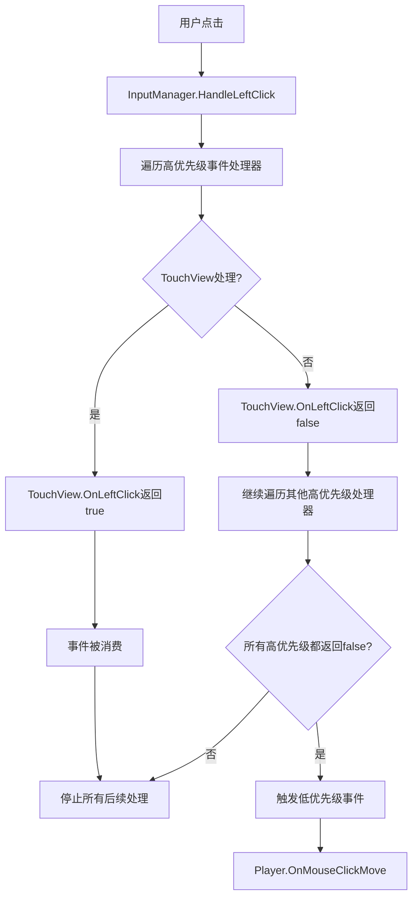

# 输入系统技术文档

## 概述
输入系统由两个核心组件构成：`InputManager` 和 `InputUtils`，共同提供完整的玩家输入处理解决方案。

- **InputManager**: 统一的输入管理器，负责**纯粹的输入检测**，通过**优先级事件系统**与其他组件通信
- **InputUtils**: 静态工具类，提供底层的鼠标点击检测、UI交互判断和射线检测功能

## 🔥 v4.0 重大更新：优先级事件系统

### 🎯 解决的核心问题
在v3.0中发现的**时序问题**：当TouchView处理建筑放置完成后退出建筑模式，Player仍然会收到同一次点击的移动命令，导致角色意外移动。

### 💡 解决方案：源头时序控制
- **优先级事件系统**: 将左键点击分为高优先级和低优先级两层处理
- **事件消费机制**: 高优先级处理器可以"消费"事件，阻止低优先级处理
- **订阅顺序无关**: 无论组件以何种顺序订阅，都能保证正确的处理顺序

### 🏗️ 架构改进
```csharp
// v4.0 架构：优先级分层处理
OnLeftClickHighPriority  // TouchView、UI组件订阅，支持事件消费
OnMouseClickMove         // Player订阅，只在未被消费时触发
```

### 🎯 关键特性
- **高优先级事件**: UI交互、建筑放置等关键操作，支持**事件消费机制**
- **低优先级事件**: 玩家移动、普通交互等常规操作
- **源头时序控制**: 从InputManager源头解决事件处理顺序问题，不依赖订阅顺序
- **零修改兼容**: 现有Player代码无需修改，自动受到优先级保护
- **调试集成**: 与DebugModel集成，支持可控的UI路径调试输出 🔥**v4.1新增**

## 设计原则

### 🎯 单一职责原则 (Single Responsibility Principle)
- **InputManager职责**：仅负责输入检测和事件分发，**不包含任何业务逻辑**
- **业务组件职责**：各自管理状态，根据收到的通用输入事件处理特定业务逻辑
- **依赖方向**：业务层依赖输入层，而非相反

### ✅ 正确的架构分层
```
业务层 (TouchView, Player, UI组件)  ←── 处理业务逻辑
    ↓ 依赖
输入层 (InputManager)               ←── 纯粹输入检测
    ↓ 依赖  
工具层 (InputUtils)                ←── 底层工具函数
```

### ❌ 错误的设计模式
```csharp
// ❌ 错误：InputManager包含业务逻辑
private bool _buildingPlacementMode;
public event Action<Vector3> OnBuildingPlaceClick; // 业务概念泄露

// ✅ 正确：InputManager只提供通用事件
public event Action<Vector3> OnLeftClick;   // 通用输入事件
public event Action OnRightClick;           // 通用输入事件
```

## 架构设计

```
GameMain
├── InputManager (纯C#单例类) ←── 优先级事件系统 + 源头时序控制
│   ├── 检测WASD移动输入 → 发布OnMoveInput事件
│   ├── 检测鼠标左键点击 → 优先级处理系统:
│   │   ├── 1️⃣ 高优先级: OnLeftClickHighPriority (支持事件消费)
│   │   └── 2️⃣ 低优先级: OnMouseClickMove (仅在未被消费时触发)
│   ├── 检测鼠标右键点击 → 发布OnRightClick事件
│   ├── 检测装备快捷键 → 发布OnUseEquipInput/OnEquipShortcutInput事件
│   ├── 发布ClickOutsideUIEvent事件
│   └── 使用 InputUtils 进行UI检测
└── InputUtils (静态工具类)
    ├── UI点击检测
    ├── 世界射线检测
    └── 点击信息打印

🎯 优先级业务组件架构:
├── TouchView ←── 订阅OnLeftClickHighPriority，在建筑放置模式下消费事件
├── Player ←── 订阅OnMouseClickMove，只在事件未被消费时处理移动
├── UI组件 ←── 订阅OnLeftClickHighPriority，处理UI交互并消费事件
└── 其他组件 ←── 订阅ClickOutsideUIEvent，处理弹窗关闭等逻辑
```

---

# InputManager 使用指南

## 特性
- **单一职责**: 仅负责输入检测，不包含任何业务逻辑
- **通用事件**: 提供OnLeftClick、OnRightClick等通用输入事件
- **架构分层**: 业务层依赖输入层，符合依赖倒置原则
- 基于事件的解耦设计
- 可动态启用/禁用输入
- 由 GameMain 统一管理的纯 C# 单例类
- 集成了项目现有的 `InputUtils` 工具类
- **事件驱动**: 点击非UI区域时自动发布 `ClickOutsideUIEvent` 事件

## 支持的输入类型

### 1. 移动输入 (WASD键)
- **事件**: `OnMoveInput(Vector3 moveDirection)`
- **触发**: 检测到 Horizontal/Vertical 轴输入时
- **参数**: 标准化的移动方向向量

### 2. 高优先级左键点击 🔥 **新架构核心**
- **事件**: `OnLeftClickHighPriority(Vector3 worldPosition) → bool`
- **触发**: 鼠标左键点击非UI区域时，**优先处理**
- **参数**: 点击位置的世界坐标
- **返回值**: `true`消费事件阻止后续处理，`false`允许后续处理
- **用途**: UI交互、建筑放置等**高优先级操作**
- **示例**: TouchView在建筑放置模式下消费事件，阻止Player移动
- **时序保证**: **不依赖订阅顺序**，始终优先于低优先级事件

### 3. 低优先级点击移动
- **事件**: `OnMouseClickMove(Vector3 targetPosition)`  
- **触发**: 鼠标左键点击非UI区域且**高优先级事件未被消费**时
- **参数**: 世界坐标中的目标位置
- **用途**: Player移动、普通世界交互等**低优先级操作**
- **时序保证**: 只有高优先级事件返回`false`时才会触发

### 4. 通用鼠标右键点击 ⭐ **核心事件**
- **事件**: `OnRightClick()`
- **触发**: 鼠标右键点击时
- **用途**: 任何组件都可以订阅此通用事件
- **示例**: TouchView订阅此事件，在建筑放置模式时取消放置

### 5. 低优先级左键点击 (扩展预留)
- **事件**: `OnLeftClickLowPriority(Vector3 worldPosition)`
- **触发**: 鼠标左键点击非UI区域且**高优先级事件未被消费**时
- **用途**: 为未来扩展预留的低优先级左键事件

### 5. 点击非UI区域事件
- **事件**: `ClickOutsideUIEvent` (通过EventManager发布)
- **触发**: 鼠标左键点击非UI区域时
- **参数**: 点击位置的世界坐标
- **用途**: 用于实现"点击外部关闭弹窗"等UI交互功能

### 6. 装备使用
- **事件**: `OnUseEquipInput()`
- **触发**: 按下空格键时

### 7. 装备快捷键
- **事件**: `OnEquipShortcutInput(int equipId)`
- **触发**: 按下Q键或E键时
- **参数**: 
  - Q键 → equipId = 30001
  - E键 → equipId = 30002

## 使用方法

### 1. 系统初始化
```csharp
// InputManager 由 GameMain 自动初始化和管理
// 无需手动创建GameObject或添加组件
// GameMain.Start() 中自动调用: var inputManager = InputManager.Instance;
// GameMain.Update() 中自动调用: InputManager.Instance.Update();
```

### 2. 🔥 优先级事件订阅 (推荐新架构)

#### 高优先级组件示例 (TouchView、UI组件)
```csharp
private void Start()
{
    if (InputManager.Instance != null)
    {
        // 订阅高优先级事件，支持事件消费
        InputManager.Instance.OnLeftClickHighPriority += HandleHighPriorityLeftClick;
        InputManager.Instance.OnRightClick += HandleRightClick;
        InputManager.Instance.OnMoveInput += HandleMoveInput;
        InputManager.Instance.OnUseEquipInput += HandleUseEquip;
        InputManager.Instance.OnEquipShortcutInput += HandleEquipShortcut;
    }
    
    // 订阅点击外部UI事件
    EventManager.Instance.Subscribe<ClickOutsideUIEvent>(OnClickOutsideUI);
}

private void OnDestroy()
{
    if (InputManager.Instance != null)
    {
        InputManager.Instance.OnLeftClickHighPriority -= HandleHighPriorityLeftClick;
        InputManager.Instance.OnRightClick -= HandleRightClick;
        InputManager.Instance.OnMoveInput -= HandleMoveInput;
        InputManager.Instance.OnUseEquipInput -= HandleUseEquip;
        InputManager.Instance.OnEquipShortcutInput -= HandleEquipShortcut;
    }
    
    EventManager.Instance.Unsubscribe<ClickOutsideUIEvent>(OnClickOutsideUI);
}

// 🎯 处理高优先级左键点击 - 支持事件消费机制
private bool HandleHighPriorityLeftClick(Vector3 worldPosition)
{
    if (_inBuildingPlacementMode && _currentPendingBuildingId > 0)
    {
        // 业务逻辑：处理建筑放置
        HandleBuildingPlacement(worldPosition);
        return true; // 🔥 消费事件，阻止Player移动等低优先级处理
    }
    else if (_inUIInteractionMode)
    {
        // 业务逻辑：处理UI交互
        HandleUIInteraction(worldPosition);
        return true; // 🔥 消费事件，阻止后续处理
    }
    
    // 没有处理特殊逻辑，返回false让其他系统继续处理
    return false;
}
```

#### 低优先级组件示例 (Player)
```csharp
private void Start()
{
    if (InputManager.Instance != null)
    {
        // Player订阅低优先级移动事件
        InputManager.Instance.OnMouseClickMove += HandleMouseClickMove;
        InputManager.Instance.OnMoveInput += HandleMoveInput;
        // 不订阅OnLeftClickHighPriority，避免冲突
    }
}

private void OnDestroy()
{
    if (InputManager.Instance != null)
    {
        InputManager.Instance.OnMouseClickMove -= HandleMouseClickMove;
        InputManager.Instance.OnMoveInput -= HandleMoveInput;
    }
}

// 处理低优先级移动 - 只在高优先级事件未被消费时触发
private void HandleMouseClickMove(Vector3 targetPosition)
{
    // 只有当高优先级事件返回false时，这里才会被调用
    // 确保建筑放置等操作不会误触发移动
    MoveToPosition(targetPosition);
}
```

#### 🎯 时序保证机制
```csharp
// InputManager内部处理逻辑（示例）
private void HandleLeftClick()
{
    Vector3 mouseWorldPos = GetWorldPosition();
    
    // 1️⃣ 先处理高优先级事件
    bool eventConsumed = false;
    if (OnLeftClickHighPriority != null)
    {
        foreach (var handler in OnLeftClickHighPriority.GetInvocationList())
        {
            if (handler(mouseWorldPos)) // TouchView返回true
            {
                eventConsumed = true;
                break; // 🔥 事件被消费，停止后续处理
            }
        }
    }
    
    // 2️⃣ 只有未被消费时才处理低优先级事件
    if (!eventConsumed)
    {
        OnMouseClickMove?.Invoke(mouseWorldPos); // Player移动
    }
}
```

### 3. 🎯 事件消费机制详解

#### 事件消费的工作原理
```csharp
// 高优先级事件处理器的返回值决定事件流向
private bool OnHighPriorityClick(Vector3 worldPosition)
{
    if (ShouldHandleClick())
    {
        ProcessClick(worldPosition);
        return true;  // 🔥 消费事件 - 阻止低优先级处理
    }
    return false;     // ✅ 不消费 - 允许低优先级处理
}
```

#### 时序问题的根本解决


### 4. 兼容性支持
```csharp
// 现有的Player代码无需修改，继续使用OnMouseClickMove
private void Start()
{
    if (InputManager.Instance != null)
    {
        InputManager.Instance.OnMouseClickMove += HandleMouseMove; // 自动受优先级保护
    }
}
```

### 4. 控制输入状态
```csharp
// 禁用输入
InputManager.Instance.SetInputEnabled(false);

// 启用输入
InputManager.Instance.SetInputEnabled(true);

// 检查输入状态
bool isEnabled = InputManager.Instance.IsInputEnabled;
```

---

# InputUtils 技术文档

## 简介
InputUtils 是一个静态工具类，为 InputManager 提供底层支持，包含鼠标点击检测、UI交互判断和详细的点击对象信息打印功能。

## 详细接口

### 基础检测方法

#### `IsPointerOverUI()`
```csharp
public static bool IsPointerOverUI()
```
- **功能**: 检测鼠标是否点击在UI上
- **返回值**: bool - 是否点击UI
- **说明**: 基于EventSystem检测，无EventSystem时返回false并警告

#### `GetMouseWorldHit(out RaycastHit hit, float maxDistance = Mathf.Infinity, int layerMask = -1)`
```csharp
public static bool GetMouseWorldHit(out RaycastHit hit, float maxDistance = Mathf.Infinity, int layerMask = -1)
```
- **功能**: 获取鼠标在世界空间的射线检测结果
- **参数**: 
  - `hit`: 射线检测结果
  - `maxDistance`: 最大检测距离，默认无限远
  - `layerMask`: 检测层级，默认检测所有层
- **返回值**: bool - 是否检测到物体

#### `GetUIRaycastResults()`
```csharp
public static List<RaycastResult> GetUIRaycastResults()
```
- **功能**: 获取UI射线检测结果列表
- **返回值**: List<RaycastResult> - UI检测结果列表
- **说明**: 使用缓存列表避免GC分配

#### `GetGameObjectPath(GameObject obj)`
```csharp
public static string GetGameObjectPath(GameObject obj)
```
- **功能**: 获取GameObject的完整层级路径
- **参数**: `obj` - 目标GameObject
- **返回值**: string - 完整的层级路径（如："Canvas/MainPanel/Button"）

### 信息打印方法

#### `PrintClickedUIObjects()`
```csharp
public static void PrintClickedUIObjects()
```
- **功能**: 打印点击的UI对象详细信息
- **输出**: 单行日志包含所有UI对象信息

#### `PrintClickedUIPath()`
```csharp
public static void PrintClickedUIPath()
```
- **功能**: 打印点击的UI对象路径信息（只显示最上层UI对象）
- **输出**: 单行日志包含最上层UI对象的完整路径
- **格式**: `UI路径检测 Path: Canvas/Panel/Button`
- **智能过滤**: 遇到TMP相关组件时自动显示其父级路径

#### `PrintClickedWorldObject(RaycastHit hit)`
```csharp
public static void PrintClickedWorldObject(RaycastHit hit)
```
- **功能**: 打印点击的世界GameObject详细信息
- **参数**: `hit` - 射线检测结果
- **输出**: 单行日志包含GameObject完整信息

### 综合处理方法

#### `HandleSafeMouseClick(System.Action onClickWorld)`
```csharp
public static void HandleSafeMouseClick(System.Action onClickWorld)
```
- **功能**: 执行安全的鼠标点击检测，只有在不点击UI时才执行游戏世界回调
- **参数**: `onClickWorld` - 点击游戏世界时的回调
- **行为**: 点击UI时打印UI信息，点击世界时执行回调

#### `HandleWorldClick(System.Action<RaycastHit> onHitWorld, System.Action onClickEmpty = null, int layerMask = -1)`
```csharp
public static void HandleWorldClick(System.Action<RaycastHit> onHitWorld, System.Action onClickEmpty = null, int layerMask = -1)
```
- **功能**: 综合的世界点击处理方法，自动判断UI/世界点击并打印相应信息
- **参数**: 
  - `onHitWorld`: 击中世界对象时的回调
  - `onClickEmpty`: 点击空白区域时的回调
  - `layerMask`: 检测层级
- **行为**: 自动处理UI点击、世界点击、空白点击三种情况

#### `AnalyzeClick()`
```csharp
public static bool AnalyzeClick()
```
- **功能**: 完整的点击分析方法，执行详细的点击检测并打印所有相关信息
- **返回值**: bool - 是否点击了UI（true为UI，false为世界或空白）

### 管理方法

#### `ClearCachedReferences()`
```csharp
public static void ClearCachedReferences()
```
- **功能**: 清理缓存的摄像机引用
- **说明**: 在场景切换时调用以避免空引用

---

# 事件系统集成

## ClickOutsideUIEvent 事件

### 事件定义
```csharp
public class ClickOutsideUIEvent : IEvent
{
    public Vector3 ClickPosition { get; }
    
    public ClickOutsideUIEvent(Vector3 clickPosition)
    {
        ClickPosition = clickPosition;
    }
}
```

### 发布时机
- 当用户点击鼠标左键且点击位置不在UI上时
- 由 `InputManager.HandleMouseClickMove()` 自动发布
- 包含点击位置的世界坐标信息

### 使用场景
- **弹窗自动关闭**: 点击弹窗外部区域时自动关闭
- **菜单隐藏**: 点击菜单外部时隐藏菜单
- **取消选择**: 点击空白区域取消当前选择状态
- **UI状态重置**: 重置各种UI交互状态

---

# 最佳实践指南

## 🎯 单一职责原则的应用

### ✅ 正确的组件职责分工

#### InputManager (输入层) - 优先级事件系统
```csharp
public class InputManager
{
    // ✅ 优先级事件系统 - 从源头控制时序
    public event Func<Vector3, bool> OnLeftClickHighPriority;  // 高优先级，支持事件消费
    public event Action<Vector3> OnMouseClickMove;              // 低优先级，只在未被消费时触发
    public event Action OnRightClick;
    
    private void HandleLeftClick()
    {
        Vector3 worldPos = GetWorldPosition();
        
        // ✅ 优先级处理：先高后低，支持事件消费
        bool eventConsumed = false;
        if (OnLeftClickHighPriority != null)
        {
            foreach (var handler in OnLeftClickHighPriority.GetInvocationList())
            {
                if (handler(worldPos)) // 高优先级处理器可以消费事件
                {
                    eventConsumed = true;
                    break; // 🔥 源头时序控制：事件被消费，停止后续处理
                }
            }
        }
        
        // 只有未被消费时才触发低优先级事件
        if (!eventConsumed)
        {
            OnMouseClickMove?.Invoke(worldPos); // Player移动等低优先级操作
        }
    }
    
    // ❌ 错误：不应包含业务状态
    // private bool _buildingPlacementMode;
    // private void SetBuildingPlacementMode(bool enable) { }
}
```

#### 高优先级业务组件 (TouchView、UI组件)
```csharp
public class TouchView : BaseView
{
    // ✅ 自己管理业务状态
    private bool _inBuildingPlacementMode = false;
    private int _currentPendingBuildingId = -1;
    
    private void Start()
    {
        // ✅ 订阅高优先级事件
        InputManager.Instance.OnLeftClickHighPriority += OnLeftClick;
    }
    
    private bool OnLeftClick(Vector3 worldPosition)
    {
        // ✅ 根据自身状态处理业务逻辑并控制事件流
        if (_inBuildingPlacementMode && _currentPendingBuildingId > 0)
        {
            HandleBuildingPlacement(worldPosition);
            return true; // 🔥 消费事件，阻止Player移动
        }
        
        // 没有特殊处理，允许其他系统继续处理
        return false;
    }
}
```

#### 低优先级业务组件 (Player)
```csharp
public class Player : CombatEntity
{
    private void Start()
    {
        // ✅ 订阅低优先级移动事件
        InputManager.Instance.OnMouseClickMove += OnMouseClickMove;
        // ❌ 不要订阅OnLeftClickHighPriority，避免与TouchView冲突
    }
    
    private void OnMouseClickMove(Vector3 targetPosition)
    {
        // ✅ 只有高优先级事件未被消费时才会被调用
        // 自动解决时序问题：建筑放置时不会误触发移动
        MoveToPosition(targetPosition);
    }
}
```

### 🔄 状态管理最佳实践

#### ❌ 错误的集中状态管理
```csharp
// ❌ InputManager不应该管理业务状态
public class InputManager
{
    private bool _buildingMode;
    private bool _attackMode;
    private bool _inventoryMode;
    
    private void HandleInput()
    {
        if (_buildingMode) { /* 建筑逻辑 */ }
        else if (_attackMode) { /* 攻击逻辑 */ }
        // 违反开闭原则，新增模式需要修改InputManager
    }
}
```

#### ✅ 正确的分散状态管理
```csharp
// ✅ 各组件管理自己的状态
public class TouchView : BaseView
{
    private bool _inBuildingPlacementMode = false;
    
    private void OnLeftClick(Vector3 pos)
    {
        if (_inBuildingPlacementMode) { /* 建筑逻辑 */ }
    }
}

public class Player : MonoBehaviour
{
    private bool _inAttackMode = false;
    
    private void OnLeftClick(Vector3 pos)
    {
        if (_inAttackMode) { /* 攻击逻辑 */ }
    }
}
```

### 🏗️ 扩展性设计原则

#### ✅ 符合开闭原则的设计
```csharp
// ✅ 添加新功能无需修改InputManager
public class NewFeatureView : BaseView
{
    private bool _inNewFeatureMode = false;
    
    private void Start()
    {
        // 直接订阅通用事件
        InputManager.Instance.OnLeftClick += OnLeftClick;
    }
    
    private void OnLeftClick(Vector3 worldPosition)
    {
        if (_inNewFeatureMode)
        {
            // 新功能的业务逻辑
            HandleNewFeature(worldPosition);
        }
    }
}
```

### 📊 事件命名规范 (v4.0更新)

#### ✅ 优先级事件命名
```csharp
// ✅ 描述输入行为 + 优先级，不涉及业务概念
OnLeftClickHighPriority  // 高优先级左键点击（支持事件消费）
OnLeftClickLowPriority   // 低优先级左键点击（预留扩展）
OnMouseClickMove         // 低优先级移动（Player使用）
OnRightClick            // 右键点击（通用）
OnMoveInput             // 移动输入（通用）
```

#### 🎯 事件优先级分类指南
```csharp
// 🔥 高优先级事件：可以消费事件，阻止后续处理
// 适用于：UI交互、建筑放置、模态对话框等
OnLeftClickHighPriority  → 返回bool，true消费事件

// ⚡ 低优先级事件：在高优先级未被消费时触发
// 适用于：Player移动、世界交互、默认行为等
OnMouseClickMove         → void方法，被动接收
OnLeftClickLowPriority   → void方法，被动接收
```

#### ❌ 业务特定事件命名
```csharp
// ❌ 包含业务概念，违反单一职责和开闭原则
OnBuildingPlaceClick    // 建筑放置点击
OnAttackClick          // 攻击点击
OnInventoryCancel      // 背包取消
```

# 系统集成和最佳实践

## InputManager 与 InputUtils 的配合

### 1. InputManager 中的使用
```csharp
// InputManager 在处理鼠标点击时使用 InputUtils
private void HandleMouseClickMove()
{
    // 使用 InputUtils 检测是否点击UI
    if (InputUtils.IsPointerOverUI())
    {
        // 打印UI路径信息
        InputUtils.PrintClickedUIPath();
        return;
    }

    // 点击了非UI区域，发布事件通知其他组件
    Vector3 mouseWorldPos = Vector3.zero;
    if (InputUtils.GetMouseWorldHit(out RaycastHit hit))
    {
        mouseWorldPos = hit.point;
        OnMouseClickMove?.Invoke(hit.point);
    }
    else
    {
        // 即使没有碰撞到物体，也要发布点击外部UI事件
        mouseWorldPos = Camera.main ? Camera.main.ScreenToWorldPoint(Input.mousePosition) : Vector3.zero;
    }

    // 发布点击非UI区域事件
    EventManager.Instance.Publish(new ClickOutsideUIEvent(mouseWorldPos));
}
```

### 2. UI组件的事件驱动实现
```csharp
// MakeMenuView.cs 示例
private void SubscribeEvents()
{
    EventManager.Instance.Subscribe<MakeMenuOpenEvent>(OnMakeMenuOpen);
    EventManager.Instance.Subscribe<MakeTypeSelectedEvent>(OnMakeTypeSelected);
    EventManager.Instance.Subscribe<ClickOutsideUIEvent>(OnClickOutsideUI); // 订阅点击外部事件
}

// 处理点击非UI区域事件
private void OnClickOutsideUI(ClickOutsideUIEvent eventData)
{
    // 只有当菜单可见时才关闭
    if (gameObject.activeInHierarchy)
    {
        CloseMakeMenu();
    }
}
```

### 3. Player.cs 的改动
原来的 `Player.cs` 中的输入处理逻辑已被移除，改为订阅 `InputManager` 的事件：

- `HandleInput()` 方法已删除
- 添加了 `SubscribeToInputEvents()` 和 `UnsubscribeFromInputEvents()` 方法
- 各种输入处理改为事件回调：
  - `OnMoveInput()` - 处理移动输入
  - `OnMouseClickMove()` - 处理鼠标点击移动
  - `OnUseEquipInput()` - 处理装备使用
  - `OnEquipShortcutInput()` - 处理装备快捷键

## 使用场景示例

### 1. 基础UI点击检测
```csharp
// 简单判断是否点击UI
if (InputUtils.IsPointerOverUI())
{
    return; // 点击了UI，不执行游戏逻辑
}
```

### 2. 实现弹窗自动关闭功能
```csharp
public class PopupWindow : MonoBehaviour
{
    void Start()
    {
        EventManager.Instance.Subscribe<ClickOutsideUIEvent>(OnClickOutside);
    }

    void OnDestroy()
    {
        EventManager.Instance.Unsubscribe<ClickOutsideUIEvent>(OnClickOutside);
    }

    private void OnClickOutside(ClickOutsideUIEvent eventData)
    {
        if (gameObject.activeInHierarchy)
        {
            ClosePopup();
        }
    }
}
```

### 3. 安全的世界点击处理
```csharp
// 在Update中使用安全点击检测
private void Update()
{
    InputUtils.HandleSafeMouseClick(() => {
        // 只有点击游戏世界时才执行的逻辑
        Debug.Log("点击了游戏世界！");
    });
}
```

### 4. 完整的点击分析
```csharp
// 获取详细点击信息用于调试
private void Update()
{
    InputUtils.HandleWorldClick(
        onHitWorld: (hit) => {
            // 处理击中的世界对象
            HandleWorldObject(hit.collider.gameObject);
        },
        onClickEmpty: () => {
            // 处理点击空白区域
            Debug.Log("点击了空白区域");
        }
    );
}
```

### 5. 场景切换管理
```csharp
// 在场景切换时清理缓存
private void OnLevelWasLoaded(int level)
{
    InputUtils.ClearCachedReferences();
}
```

## 注意事项

### 使用约束
- **InputManager**: 纯C#单例类，由GameMain统一管理，无需手动创建
- **InputUtils**: 静态工具类，无需实例化，直接调用方法
- **EventSystem依赖**: UI检测功能依赖场景中的EventSystem组件  
- **主摄像机要求**: 世界射线检测需要场景中存在Camera.main

### 性能考虑
- **摄像机缓存**: 自动缓存主摄像机引用，提升性能
- **列表复用**: UI检测使用静态列表避免GC分配
- **StringBuilder优化**: 日志输出使用StringBuilder减少字符串分配
- **统一更新**: InputManager由GameMain统一驱动，避免多个Update循环
- **事件驱动**: 避免多个UI组件重复检测输入，统一由InputManager处理

### 调试功能
- **详细日志**: 提供丰富的点击信息用于调试
- **UI路径打印**: 自动显示UI对象的完整层级路径
- **智能过滤**: TMP组件自动显示父级路径，提供更有意义的信息
- **单行输出**: 所有日志信息合并为单行，保持控制台整洁
- **组件信息**: 自动显示点击对象的所有组件信息

## 参考的项目代码
- **EventManager.cs** (Assets/Scripts/Core/Event/EventManager.cs) - 单例模式设计
- **GameEvents.cs** (Assets/Scripts/Core/Event/GameEvents.cs) - 事件定义
- **ClockModel.cs, SaveModel.cs** - Model类设计模式
- **GameMain.cs** (Assets/Scripts/GameMain.cs) - 统一系统管理

## 系统优势 (v4.0更新)

### 🔥 优先级事件系统优势 (v4.0新增)
1. **源头时序控制**: 从InputManager源头解决事件处理顺序问题，不依赖订阅顺序
2. **事件消费机制**: 高优先级处理器可以消费事件，彻底阻止低优先级处理
3. **零时序依赖**: 无论TouchView和Player谁先订阅，都能保证正确的处理顺序
4. **架构级解决方案**: 在框架层面解决时序问题，而非在业务层打补丁
5. **通用时序保护**: 为所有未来功能提供内置的时序冲突保护

### 📊 核心架构优势
6. **单一职责**: InputManager仅负责输入检测，业务组件各自管理状态，职责边界清晰
7. **架构分层**: 符合依赖倒置原则，业务层依赖输入层，而非相反
8. **优先级事件**: OnLeftClickHighPriority、OnMouseClickMove等分层事件，支持复杂交互场景
9. **开闭原则**: 添加新功能无需修改InputManager，只需选择合适优先级订阅事件
10. **事件驱动**: 基于优先级事件的松耦合通信机制，避免直接依赖

### 🛡️ 可靠性优势
11. **解耦设计**: 输入逻辑与具体业务逻辑完全分离
12. **复用性强**: 多个组件可以订阅相同优先级的输入事件
13. **易于维护**: 输入逻辑集中管理，业务逻辑分散管理，时序逻辑框架化
14. **扩展性强**: 新功能开发无需理解现有业务逻辑，直接选择合适优先级订阅
15. **调试友好**: 提供丰富的调试信息和UI路径打印功能

### ⚡ 性能与质量优势
16. **性能优化**: 缓存机制和对象复用减少GC压力
17. **测试友好**: 输入层和业务层可以独立测试，时序逻辑可预测
18. **零竞争条件**: 优先级机制从根本上消除了事件处理的竞争条件

## 重构演进历史
- **v1.0**: **业务特定事件** → **通用输入事件**
- **v2.0**: **集中状态管理** → **分散状态管理** 
- **v3.0**: **强耦合设计** → **松耦合架构** (单一职责原则)
- **v4.0**: **订阅顺序依赖** → **优先级事件系统** (源头时序控制) 🔥
- **v4.1**: **调试集成** → **与DebugModel集成的可控调试输出** 🔥

*版本: 4.1 - 优先级事件系统 + 调试集成版* 